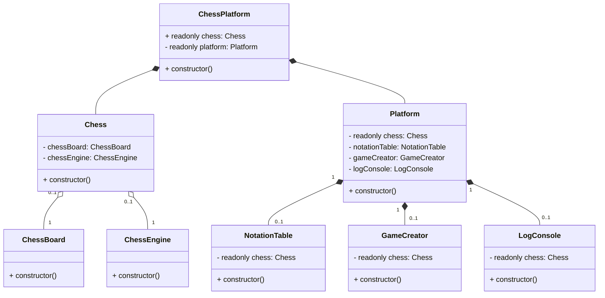

<h1 align = "center">Chess Platform</h1>
<p><a href = "https://chess-platform.vercel.app/">Live Demo</a>. (The site may open slowly because I deployed the project to a free render account)</p>
<h3>Table of Contents </h3>
<ol>
    <li><a href = "#introduction">Introduction</a></li>
    <li><a href = "#features">Features</a></li>
    <li><a href = "#architecture">Architecture</a></li>
    <li><a href = "#installation">Installation</a></li>
    <li><a href = "#usage">Usage</a></li>
    <li><a href = "#testing">Testing</a></li>
    <li><a href = "#epilogue">Epilogue</a></li>
    <li><a href = "#sources">Sources</a></li>
</ol>
<h3>Introduction</h3>
<p>Chess Platform is a web application (a portfolio project) that allows you to play chess against yourself, a friend, or the Stockfish engine with adjustable difficulty levels. While the project does not use advanced chess programming techniques (such as 0x88 or bitboards), it fully implements all chess rules. The application is divided into three main components: Chess Platform, Platform, and Chess. Detailed information about these parts can be found in the <a href="#architecture">Architecture</a> section. The client side is developed entirely in <b>TypeScript</b> and tested with <b>Vitest</b>, while the server side is built using <b>Bun.js</b>.</p>
</p>

<h3>Features</h3>
<ul>
    <li>by <a href = "https://github.com/bberkay/chess-platform/tree/main/src">ChessPlatform</a>
        <ul>
            <li>Connection between Platform and Chess</li>
        </ul>
    </li>
    <li>by <a href = "https://github.com/bberkay/chess-platform/tree/main/src/Chess">Chess</a>
        <ul>
            <li><b>General Rules:</b> Check, Checkmate, Stalemate.</li>
            <li><b>Other Rules:</b> <a href = "https://en.wikipedia.org/wiki/Threefold_repetition">Threefold repetition</a>, <a href = "https://en.wikipedia.org/wiki/Fifty-move_rule">Fifty-move rule</a>.</li>
            <li><b>Board:</b> Includes animations and sounds for moves. Also, easily customizable from <a href = "https://github.com/bberkay/chess-platform/blob/main/public/css/chessboard.css">css</a>.</li>
            <li><b>Move Calculation</b>: Calculation and validation of every piece.</li>
            <li><b>Special Moves:</b> <a href = "https://en.wikipedia.org/wiki/Castling">Castling</a>, <a href = "https://en.wikipedia.org/wiki/Promotion_(chess)">Promotion</a>, <a href = "https://en.wikipedia.org/wiki/En_passant">En Passant</a>.</li>
            <li><b>Score Calculation:</b> For more information check <a href = "https://en.wikipedia.org/wiki/Chess_piece_relative_value">this.</a></li>
            <li><b>Algebraic Notation:</b> For more information check <a href = "https://en.wikipedia.org/wiki/Algebraic_notation_(chess)">this.</a></li>
            <li><b>Fen Notation:</b> For more information check <a href = "https://en.wikipedia.org/wiki/Forsyth%E2%80%93Edwards_Notation">this.</a></li>
            <li><b>Caching:</b> With active-passive options.</li>
            <li><b>Logging:</b> Detailed descriptions of calculation in engine and board.</li>
            <li><b>Standalone Versions:</b> For use just board or engine.</li>
        </ul>
    </li>
    <li>by <a href = "https://github.com/bberkay/chess-platform/tree/main/src/Platform">Platform</a>
        <ul>
            <li><b>Notation Table:</b> Shows the algebraic notation calculated by chess on UI.</li>
            <li><b>Score Section:</b> Shows the score calculated by chess on UI.</li>
            <li><b>Game Creator:</b> Input for custom fen notation and select box for some template fen notations.</li>
            <li><b>Log Console:</b> Shows the log created by chess on UI in every action.</li>
        </ul>
    </li>   
</ul>
<h3>Architecture</h3>
<h5><i>Technologies: HTML, CSS, JS, TypeScript, Node, Vite, Vitest</i></h5>
<p>In this section, I will explain the project's architecture without going into too much detail as much as possible. As I mentioned in the introduction, the project currently consists of two main parts and the third part that provides connection between main parts and manages the app.</p>
<ul>
    <li>
        <strong><a href = "https://github.com/bberkay/chess-platform/blob/main/src/ChessPlatform.ts">Chess Platform</a></strong><br/>
        The part that provides connection between Platform and Chess. Creates Chess instance and provides it to Platform instance. So, chess methods can be used by platform's components. And by connecting Platform and Chess, it provides the start point for the project.
    </li><br/>
    <li>
        <strong><a href = "https://github.com/bberkay/chess-platform/blob/main/src/Chess/Chess.ts">Chess</a></strong><br/>
        Chess provides a playable game on web by using ChessEngine and ChessBoard instances. Also, has a Cache system for save the game and log system for save the details of every action.  
        <br/>
        <ul>
            <li>
                <strong><a href = "https://github.com/bberkay/chess-platform/blob/main/src/Chess/Engine/ChessEngine.ts">ChessEngine</a></strong><br/>
                ChessEngine provides the mechanism of the game. All the rules of chess are implemented in this class and can be used as standalone or directly by Chess class for playable game by connecting with ChessBoard.   
            </li>
            <li>
                <strong><a href = "https://github.com/bberkay/chess-platform/blob/main/src/Chess/Board/ChessBoard.ts">ChessBoard</a></strong><br/>
                ChessBoard provides the interactive chessboard that players can make actions but doesn't have any mechanism. ChessBoard can be used as standalone or directly by Chess class for playable game by connecting with ChessEngine. Also, both board and pieces can be visualized from <a href = "https://github.com/bberkay/chess-platform/tree/main/src/Chess/Board/Assets">assets.</a>
            </li>
        </ul>
    </li><br>
    <li>
        <strong><a href = "https://github.com/bberkay/chess-platform/blob/main/src/Platform/Platform.ts">Platform</a></strong><br/>
        Platform provides some UI components by using chess instance that connected by Chess Platform. Currently, Platform has four components: Notation Table that shows every played move of players as algebraic notation, Score Section(comes with notation table) that shows score of every player, Game Creator that provide 2 different create form(used with fen notation) for users, and Log Console that shows the log of every action of players on UI by using chess instance's log system. 
    </li>
</ul>



<h3>Installation</h3>
<ol>
    <li>
        Clone the repository.
        <br/>
        <code>git clone https://github.com/bberkay/chess.git</code>
    </li>
    <li>
        Server
        <ol>
            <li>
                Go to the server directory.
                <br/>
                <code>cd server</code>
            </li>
            <li>
                Install the dependencies.
                <br/>
                <code>bun install</code>
            </li>
            <li>
                Run the server
                <br/>
                <code>bun run src/main.ts</code>
            </li>
        </ol>
    </li>
    <li>
    Client
        <ol>
            <li>
                Go to the client directory.
                <br/>
                <code>cd client</code>
            </li>
            <li>
                Install the dependencies.
                <br/>
                <code>bun install</code>
            </li>
            <li>
                Run the project
                <br/>
                <code>bun run dev</code>
            </li>
        </ol>
    </li>
    <small>Or build with <code>bun run build</code></small>
</ol>
<h3>Usage</h3>
<h4>ChessPlatform(Full Version)</h4>

```html
<html>
  <head>
    <title>Chess Platform</title>
  </head>
  <body>
    <!-- Chess and Components -->
    <main>
        <div class="left">
            <div id="navbar"></div>
            <div id="log-console"></div>
            <div id="settings-menu"></div>
            <div id="appearance-menu"></div>
            <div id="about-menu"></div>
        </div>
        <div class="center">
            <div id="chessboard"></div>
            <div id="navigator-modal"></div>
            <div id="board-creator"></div>
        </div>
        <div class="right">
            <div id="notation-menu"></div>
            <div id="piece-creator"></div>
        </div>
    </main>

    <!-- Initiate Chess Platform -->
    <script type="module" async>
      import { ChessPlatform } from "./src/ChessPlatform";

      /**
       * If there is a game in cache, then platform
       * will load it. Otherwise, platform will create
       * a new standard game.
       */
      const chessPlatform = new ChessPlatform(); 
    </script>
  </body>
</html>
```
<p>This is also current usage in <a href = "https://github.com/bberkay/chess/blob/main/client/src/index.html">index.html</a> of the <a href = "#chess-platform">Live Demo</a>.</p>
<p>
<h4>Method List of ChessPlatform</h4>
<span>Most (but not all) of the public methods you can use within the <code>ChessPlatform</code> class.</span><br/>
<small>You can see the types marked in <i>italic</i> from <a href = "https://github.com/bberkay/chess/blob/main/client/src/Types/index.ts">here</a> and more detailed explanation of the methods from <a href = "
https://github.com/bberkay/chess/blob/main/client/src/ChessPlatform.ts">here</a>.</small>
</p>

```javascript
/**
 * Add custom callbacks to the WebSocket events. 
 * Does not override the default callbacks.
 * */
bindSocketOperationCallbacks(
  onOpen: (() => void) | null = null, 
  onMessage: (<T extends WsTitle>(wsTitle: T, wsData: WsData<T>) => void) | null = null, 
  onError: (() => void) | null = null, 
  onClose: (() => void) | null = null
): void 
```

<ul>
    <li>
    <code>bindSocketOperationCallbacks(onOpen: (() => void) | null = null, onMessage: (<i>&lt;T extends WsTitle&gt;</i>(wsTitle: <i>T</i>, wsData: <i>WsData&lt;T&gt;</i>) => void) | null = null, onError: (() => void) | null = null, onClose: (() => void) | null = null): void</code><br/>Add custom callbacks to the WebSocket events. Does not override the default callbacks.
    </li>
    <li><code>createLobby(createLobbyReqParams: <i>CreateLobbyReqParams</i>): void</code><br/> Establishes a WebSocket connection for creating a new lobby.</li>
    <li><code>joinLobby(joinLobbyReqParams: <i>JoinLobbyReqParams</i>): void</code><br/> Establishes a WebSocket connection for joining an existing lobby.</li>
    <li><code>cancelLobby(): void</code><br/> Cancel the game and close the socket connection.</li>
    <li><code>abortGame(): void</code><br/> Abort the game and send the abort command to the server.</li>
    <li><code>resign(): void</code><br/> Resign the game and send the resign command to the server.</li>
    <li><code>sendPlayAgainOffer(): void</code><br/> Send the play again offer to the opponent.</li>
    <li><code>sendDrawOffer(): void</code><br/> Send the draw offer to the opponent.</li>
    <li><code>sendUndoOffer(): void</code><br/> Send the undo move offer to the opponent.</li>
    <li><code>acceptDrawOffer(): void</code><br/> Accept the draw offer from the opponent.</li>
    <li><code>acceptPlayAgainOffer(): void</code><br/> Accept the play again offer from the opponent.</li>
    <li><code>acceptUndoOffer(): void</code><br/> Accept the undo move offer from the opponent.</li>
    <li><code>cancelOffer(): void</code><br/> Cancel the offer that sent to the opponent.</li>
    <li><code>declineSentOffer(): void</code><br/> Decline the sent offer from the opponent.</li>
    <li><code>terminateConnection(resetPlatform: boolean = true): void</code><br/> Clear the last connection restore the platform components.</li>
</ul>

<h4>Chess(without Platform)</h4>

```html
<html>
  <head>
    <title>Chess without Platform</title>
  </head>
  <body>
    <div id="chessboard"></div>
    <!-- Required while using Chess -->

    <!-- Initiate Chess without Platform -->
    <script type="module" async>
      import { Chess } from '@Chess/Chess';
      import { BotAttributes, BotDifficulty, BotColor } from '@Chess/Bot';
      import { Color, Square } from '@Chess/Types';

      // If there is a game in cache, then chess
      // will load it. Otherwise, chess will
      // create a new standard game.
      const chess = new Chess();

      // Stockfish can be added to the game
      // with different difficulty levels
      // and colors.
      const botAttributes = {
          color: BotColor.Random
          difficulty: BotDifficulty.Medium
      }
      chess.addBotToCurrentGame(botAttributes);

      // Listening the moves
      document.addEventListener(ChessEvent.onPieceMoved, ((
          event
      ) => {
          console.log(event.detail.from, event.detail.to);
          console.log(chess.getGameAsFenNotation());
      }));
    </script>
  </body>
</html>
```

<p>For other custom events check the <code>ChessEvent</code> from: <a href="https://github.com/bberkay/chess/blob/main/client/src/Chess/Types/index.ts">./client/src/Chess/Types/index.ts</a></p>
<h4>Method List of Chess</h4>
<p>
<span>Most (but not all) of the public methods you can use within the <code>Chess</code> class.</span><br/>
<small>You can see the types marked in <i>italic</i> from <a href = "https://github.com/bberkay/chess/blob/main/client/src/Chess/Types/index.ts">here</a> and more detailed explanation of the methods from <a href = "
https://github.com/bberkay/chess/blob/main/client/src/Chess/Chess.ts">here</a>.</small>
</p>
<ul>
    <li><code>createGame(position: <i>JsonNotation</i> | <i>StartPosition</i> | string = <i>StartPosition.Standard</i>, durations: <i>Durations</i> | null = null): void</code> <br/> Creates a new game with the given position and durations.</li>
    <li><code>createPiece(color: <i>Color</i>, type: <i>PieceType</i>, square: <i>Square</i>): void</code><br/>
    Creates a new piece with the given color, type and square.</li>
    <li><code>removePiece(square: <i>Square</i>): void</code><br/> Removes the piece on the given square.</li>
    <li><code>addBotTuCurrentGame(botAttributes: <i>BotAttributes</i>): void</code><br/> Adds a bot to the current game with the given attributes.</li>
    <li><code>getLastCreatedBotAttributes():  <i>BotAttributes</i> | null</code><br/> Returns the last created bot's attributes if there is any.</li>
    <li><code>terminateBotIfExist(): void</code><br/> Terminates the bot if there is any.</li>
    <li><code>takeBack(onEngine: boolean = false, undoColor: <i>Color</i> | null = null): void</code><br/> Takes back the last move.</li>
    <li><code>takeForward(): void</code><br/> Takes forward the last taken back move.</li>
    <li><code>goToSpecificMove(moveIndex: number): void</code><br/> Goes to the specific move by the given index.</li>
    <li><code>getDurations(): <i>Durations</i> | null</code><br/> Returns the durations of the game if the durations are set.</li>
    <li><code>getPlayersRemainingTime(): <i>RemainingTimes</i></code><br/> Returns the remaining times of the players if the durations are set.</li>
    <li><code>getTurnColor(ignoreTakeBack: boolean = true): <i>Color</i></code><br/> Returns the color of the current turn or taken back board's, if <code>ignoreTakeBack</code> is <code>false</code>.</li>
    <li><code>getGameStatus(ignoreTakeBack: boolean = true): <i>GameStatus</i></code><br/> Returns the status of the current game or taken back board's.</li>
    <li><code>getAlgebraicNotation(ignoreTakeBack: boolean = true): ReadonlyArray&lt;string&gt;</code><br/> Returns the algebraic notation of the current game or taken back board's.</li>
    <li><code>getMoveHistory(ignoreTakeBack: boolean = true): ReadonlyArray<i>&lt;Move&gt;</i></code><br/> Returns the move history of the current game or taken back board's.</li>
    <li><code>getScores(ignoreTakeBack: boolean = true): Readonly<i>&lt;Scores&gt;</i></code><br/> Returns the scores of the current game or taken back board's.</li>
    <li><code>getGameAsFenNotation(ignoreTakeBack: boolean = true): string</code><br/> Returns the fen notation of the current game or taken back board's.</li>
    <li><code>getGameAsJsonNotation(ignoreTakeBack: boolean = true): <i>JsonNotation</i></code><br/> Returns the json notation of the current game or taken back board's.</li>
    <li><code>getGameAsAscii(ignoreTakeBack: boolean = true): string</code><br/> Returns the ASCII representation of the current game or taken back board's.</li>
    <li><code>getBoardHistory(): ReadonlyArray<i>&lt;JsonNotation&gt;</i></code><br/> Returns the board history of the current game. After every move, the board is saved as json notation.</li>
</ul>

<h4>ChessBoard(Standalone)</h4>

```html
<html>
  <head>
    <title>Chessboard Standalone</title>
  </head>
  <body>
    <div id="chessboard"></div>
    <!-- Required while using ChessBoard -->

    <!-- Initiate Chessboard as Standalone -->
    <script type="module" async>
      import {
        ChessBoard,
        AnimationSpeed,
        Config,
      } from "@Chess/Board/ChessBoard";
      import { Square } from "@Chess/Types";

      // Standard game will be created in constructor.
      const chessBoard = new ChessBoard();

      // Set configuration of the board(optional).
      const config: Config = {
        enableSoundEffects: true,
        enablePreSelection: false,
        showHighlights: true,
        enableWinnerAnimation: true,
        animationSpeed: AnimationSpeed.Slow,
      };
      chessBoard.setConfig(config);

      // Bind move event callbacks.
      // This is a basic example:
      let selectedSquare: Square | null = null;
      let preSelectedSquare: Square | null = null;
      let preMoves: { selectedSquare: Square, targetSquare: Square }[] = [];
      chessBoard.bindMoveEventCallbacks({
        onPieceSelected: (squareId: Square) => {
          selectedSquare = squareId;
        },
        onPiecePreSelected: (squareId: Square) => {
          preSelectedSquare = squareId;
        },
        onPieceMoved: (squareId: Square) => {
          console.log("Piece moved to: ", squareId);
          selectedSquare = null;
        },
        onPiecePreMoved: (
          squareId: Square,
          squareClickMode: SquareClickMode
        ) => {
          console.log("Piece pre-moved to: ", squareId);
          if (squareClickMode === SquareClickMode.PrePromote)
            chessBoard.showPromotionMenu(squareId);
          else
            preMoves.push({
              selectedSquare: preSelectedSquare,
              targetSquare: squareId,
            });
        },
        onPreMoveCanceled: () => {
          console.log("Pre-move canceled.");
          preSelectedSquare = null;
          preMoves = [];
        },
      });
    </script>
  </body>
</html>
```

<h4>Method List of ChessBoard</h4>
<p>
<span>Most (but not all) of the public methods you can use within the <code>ChessBoard</code> class.</span><br/>
<small>You can see the types marked in <i>italic</i> from <a href = "https://github.com/bberkay/chess/blob/main/client/src/Chess/Board/Types/index.ts">here</a> and more detailed explanation of the methods from <a href = "
https://github.com/bberkay/chess/blob/main/client/src/Chess/Board/ChessBoard.ts">here</a>.</small>
</p>
<ul>
    <li><code>setConfig(config: Partial&lt;ChessBoard["config"]&gt;): void</code><br/> Set the configuration of the chess board.</li>
    <li><code>createGame(position: <i>JsonNotation</i> | <i>StartPosition</i> | string = <i>StartPosition.Standard</i>): void</code> <br/> Creates a new game with the given position.</li>
    <li><code>createPiece(color: <i>Color</i>, type: <i>PieceType</i>, square: <i>Square</i>, isGhost: boolean = false): void</code><br/> Creates a new piece with the given color, type and square.</li>
    <li><code>removePiece(square: HTMLDivElement | HTMLElement | Element | <i>Square</i>): void</code><br/> Removes the piece on the given square.</li>
    <li><code>setTurnColor(color: <i>Color</i>): void</code><br/> Sets the turn color of the board.</li>
    <li><code>bindMoveEventCallbacks(callbacks: { onPieceSelected?: (squareId: <i>Square</i>) => void; onPiecePreSelected?: (squareId: <i>Square</i>) => void; onPieceMoved?: (squareId: <i>Square</i>) => void; onPiecePreMoved?: (squareId: <i>Square</i>, squareClickMode: <i>SquareClickMode</i>) => void; onPreMoveCanceled?: () => void }): void</code><br/> Bind functions to the specific events of the chess board. Does not override the previous event bindings.</li>
    <li><code>highlightMoves(moves: <i>Moves</i> | null = null, isPreMove: boolean = false): void</code><br/> Highlights the moves on the board.</li>
    <li><code>refresh(savePreMoveEffects: boolean = false): void</code><br/> Refreshes the board.</li>
    <li><code>flip(): void</code><br/> Flips the board.</li>
    <li><code>isFlipped(): boolean</code><br/> Returns whether the board is flipped or not.</li>
    <li><code>lock(disablePreSelection: boolean = false, showDisabledEffect: boolean = false): void</code><br/> Locks the board.</li>
    <li><code>isLocked(): boolean</code><br/> Returns whether the board is locked or not.</li>
    <li><code>showStatus(status: <i>GameStatus</i>): void</code><br/> Shows the status on the board.</li>
    <li><code>showPromotionMenu(promotionSquare: HTMLElement | <i>Square</i>): void</code><br/> Shows the promotion menu on the given square.</li>
    <li><code>closePromotionMenu(): void</code><br/> Closes the promotion menu.</li>
    <li><code>isPromotionMenuShown(): boolean</code><br/> Returns whether the promotion menu is shown or not.</li>
    <li><code>lockActionsOfColor(color: <i>Color</i>): void</code><br/> Locks the actions for the given color.</li>
    <li><code>getLockedColor(): <i>Color</i> | null</code><br/> Returns the locked color if there is any.</li>
    <li><code>getAllSquares(): NodeListOf&lt;HTMLDivElement&gt;</code><br/> Returns all the squares of the board.</li>
    <li><code>getAllPieces(): NodeListOf&lt;HTMLDivElement&gt;</code><br/> Returns all the pieces of the board.</li>
    <li><code>getClosestSquareElement(element: HTMLElement): HTMLElement | null</code><br/> Returns the closest square element of the given element.</li>
    <li><code>getPieceElementOnSquare(squareElement: HTMLDivElement | Element | <i>Square</i>): HTMLDivElement</code><br/> Returns the piece element of the given square.</li>
    <li><code>getSelectedSquareElement(): HTMLDivElement | null</code><br/> Returns the selected square element if there is any.</li>
    <li><code>getPieceColor(squareOrPieceElement: HTMLDivElement | Element | <i>Square</i>): <i>Color</i></code><br/> Returns the color of the piece on the given square.</li>
    <li><code>getPieceType(squareOrPieceElement: HTMLDivElement | Element | <i>Square</i>): <i>PieceType</i></code><br/> Returns the type of the piece on the given square.</li>
    <li><code>getSquareElementOfPiece(pieceElement: HTMLDivElement | Element): HTMLDivElement</code><br/> Returns the square element of the given piece.</li>
    <li><code>getSquareId(squareElement: HTMLDivElement | Element): <i>Square</i></code><br/> Returns the square id of the given square element.</li>
    <li><code>getSquareClickMode(square:<i>Square</i> | HTMLDivElement | Element): <i>SquareClickMode</i></code><br/> Returns the click mode of the given square.</li>
</ul>

<h4>ChessEngine(Standalone)</h4>

```typescript
// somefile.ts/somefile.js
import { ChessEngine } from "@Chess/Engine/ChessEngine";
import { Square } from "@Chess/Types";

// Standard game will be created in constructor.
const chessEngine = new ChessEngine();

// Get moves of the piece on the given square.
// This is optional, you don't have to use it to play move.
const moves: Moves = chessEngine.getMoves(Square.e2);
console.log(moves);
//  Example `moves` output:
//  {
//    [MoveType.Normal]: [Square.e3, Square.e4],
//    [MoveType.Castling]: [],
//    [MoveType.EnPassant]: []
//  }
//

// Play on engine(without board)
chessEngine.playMove(Square.e2, Square.e4);

// Get the fen notation of the current game
const fen: string = chessEngine.getGameAsFenNotation();
console.log(fen);
// Example `fenNotation` output:
// rnbqkbnr/pppppppp/8/8/4P3/8/PPPP1PPP/RNBQKBNR b KQkq - 0 1

// Print the ASCII representation of the current game
console.log(chessEngine.getGameAsAscii());
// Example `ASCII` output:
// +---+---+---+---+---+---+---+---+
// | r   n   b   q   k   b   n   r | 8
// | p   p   p   p   p   p   p   p | 7
// | .   .   .   .   .   .   .   . | 6
// | .   .   .   .   .   .   .   . | 5
// | .   .   .   .   P   .   .   . | 4
// | .   .   .   .   .   .   .   . | 3
// | P   P   P   P   .   P   P   P | 2
// | R   N   B   Q   K   B   N   R | 1
// +---+---+---+---+---+---+---+---+
//   a   b   c   d   e   f   g   h
```

<h4>Method List of ChessEngine</h4>
<p>
<span>Most (but not all) of the public methods you can use within the <code>ChessEngine</code> class.</span><br/>
<small>You can see the types marked in <i>italic</i> from <a href = "https://github.com/bberkay/chess/blob/main/client/src/Chess/Engine/Types/index.ts">here</a> and more detailed explanation of the methods from <a href = "
https://github.com/bberkay/chess/blob/main/client/src/Chess/Engine/ChessEngine.ts">here</a>.</small>
</p>
<ul>
    <li><code>createGame(position: <i>JsonNotation</i> | <i>StartPosition</i> | string = <i>StartPosition.Standard</i>): void</code> <br/> Creates a new game with the given position.</li>
    <li><code>createPiece(color: <i>Color</i>, type: <i>PieceType</i>, square: <i>Square</i>): void</code><br/>
    Creates a new piece with the given color, type and square.</li>
    <li><code>removePiece(square: <i>Square</i>): void</code><br/> Removes the piece on the given square.</li>
    <li><code>getMoves(square: <i>Square</i>, isPreCalculation: boolean = false): Moves | null</code><br/> Returns the moves of the piece on the given square.</li>
    <li><code>playMove(from: <i>Square</i>, to: <i>Square</i>, moveType: <i>MoveType</i> | null = null): void</code><br/> Plays the move on the engine with the given squares.</li>
    <li><code>takeBack(undoColor: <i>Color</i> | null = null): void</code><br/> Takes back the last move.</li>
    <li><code>getDurations(): <i>Durations</i> | null</code><br/> Returns the durations of the game if the durations are set.</li>
    <li><code>getPlayersRemainingTime(): <i>RemainingTimes</i></code><br/> Returns the remaining times of the players if the durations are set.</li>
    <li><code>getTurnColor(): <i>Color</i></code><br/> Returns the color of the current turn.</li>
    <li><code>getGameStatus(): <i>GameStatus</i></code><br/> Returns the status of the current game.</li>
    <li><code>getAlgebraicNotation(): ReadonlyArray&lt;string&gt;</code><br/> Returns the algebraic notation of the current game.</li>
    <li><code>getMoveHistory(): ReadonlyArray<i>&lt;Move&gt;</i></code><br/> Returns the move history of the current game.</li>
    <li><code>getBoardHistory(): ReadonlyArray<i>&lt;JsonNotation&gt;</i></code><br/> Returns the board history of the current game. After every move, the board is saved as json notation.</li>
    <li><code>getScores(): Readonly<i>&lt;Scores&gt;</i></code><br/> Returns the scores of the current game.</li>
    <li><code>getGameAsFenNotation(): string</code><br/> Returns the fen notation of the current game.</li>
    <li><code>getGameAsJsonNotation(): <i>JsonNotation</i></code><br/> Returns the json notation of the current game.</li>
    <li><code>getGameAsAscii(): string</code><br/> Returns the ASCII representation of the current game.</li>
</ul>
<p>Check <a href="https://github.com/bberkay/chess/blob/main/client/src/Chess/Chess.ts">Chess.ts</a> for more ready-to-play implementation.</p>
<h3>Testing</h3>
<p>Chess Platform is tested with <i>Vitest</i>. Tests consist mostly of engine tests like move calculation, move validation, checkmate, stalemate, etc. Also, there are some tests for converting operations like fen notation to <a href = "https://github.com/bberkay/chess-platform/blob/main/src/Chess/Types/index.ts#L78">json notation</a>.
</p>
<span>All the tests can be run with the following command.</span>
<br/>
<code>bun run test</code>
<br/>
<br/>
<span>Or run a specific test with the following command.</span>
<br/>
<code>bun run test en-passant</code>
<br/>
<br/>
<span>All tests can be found in the <a href = "https://github.com/bberkay/chess/tree/main/client/tests">tests</a> directory.</span>

<h3>Epilogue</h3>
<p>...</p>
<h3>Sources</h3>
<ul>
    <li><a href = "https://github.com/lichess-org/stockfish.js">Stockfish.js (Bot)</a></li>
    <li><a href = "https://github.com/lichess-org/lila/tree/master/public/piece/maestro">Pieces</a></li>
    <li><a href = "https://github.com/lichess-org/lila/tree/master/public/sound/standard">Sounds #1</a></li>
    <li><a href = "https://www.chess.com/forum/view/general/chessboard-sound-files">Sounds #2</a></li>
    <li><a href = "https://www.transparenttextures.com/">Board Effect</a></li>
    <li><a href = "https://commons.wikimedia.org/wiki/Category:SVG_chess_pieces">King Icon</a></li>
</ul>
<hr>
<h5 align="center"><a href="mailto:berkaykayaforbusiness@outlook.com">berkaykayaforbusiness@outlook.com</a></h5>
