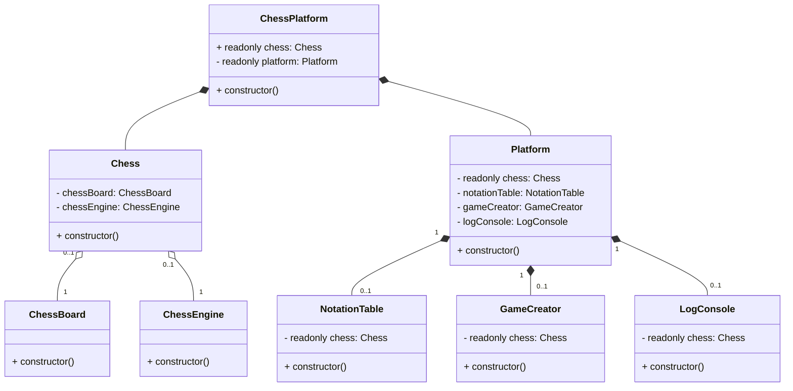

<h1 align = "center">Chess Platform</h1>
<p><a href = "https://chess-platform.onrender.com/">Live Demo</a> (The site may open slowly because I deployed the project to a free render account)</p>
<h3>Table of Contents</h3>
<ol>
    <li><a href = "#introduction">Introduction</a></li>
    <li><a href = "#features">Features</a></li>
    <li><a href = "#architecture">Architecture</a></li>
    <li><a href = "#installation">Installation</a></li>
    <li><a href = "#usage">Usage</a></li>
    <li><a href = "#testing">Testing</a></li>
    <li><a href = "#future-plans">Future Plans</a></li>
</ol>
<h3>Introduction</h3>
<p>Chess Platform is a project that I developed as a system design work. This project is 
not designed by using chess programming techniques(0x88, bitboards, etc.). But all the
rules of chess are implemented in this project. The project consists of three parts:
Chess Platform, Platform, and Chess. More detailed information about these parts can be
found in the <a href = "https://github.com/bberkay/chess-platform/tree/main#architecture">Architecture</a> section. The project is written entirely in TypeScript and tested with <a href = "https://vitest.dev/">Vitest</a>.
<p></p>

<h3>Features</h3>
<ul>
    <li>by <a href = "https://github.com/bberkay/chess-platform/tree/main/src">ChessPlatform</a>
        <ul>
            <li>Connection between Platform and Chess</li>
        </ul>
    </li>
    <li>by <a href = "https://github.com/bberkay/chess-platform/tree/main/src/Chess">Chess</a>
        <ul>
            <li><b>General Rules:</b> Check, Checkmate, Stalemate.</li>
            <li><b>Other Rules:</b> <a href = "https://en.wikipedia.org/wiki/Threefold_repetition">Threefold repetition</a>, <a href = "https://en.wikipedia.org/wiki/Fifty-move_rule">Fifty-move rule</a>.</li>
            <li><b>Board:</b> Includes animations and sounds for moves. Also, easily customizable from <a href = "https://github.com/bberkay/chess-platform/blob/main/src/Chess/Board/Assets/css/chessboard.css">css</a>.</li>
            <li><b>Move Calculation</b>: Calculation and validation of every piece.</li>
            <li><b>Special Moves:</b> <a href = "https://en.wikipedia.org/wiki/Castling">Castling</a>, <a href = "https://en.wikipedia.org/wiki/Promotion_(chess)">Promotion</a>, <a href = "https://en.wikipedia.org/wiki/En_passant">En Passant</a>.</li>
            <li><b>Score Calculation:</b> For more information check <a href = "https://en.wikipedia.org/wiki/Chess_piece_relative_value">this.</a></li>
            <li><b>Algebraic Notation:</b> For more information check <a href = "https://en.wikipedia.org/wiki/Algebraic_notation_(chess)">this.</a></li>
            <li><b>Fen Notation:</b> For more information check <a href = "https://en.wikipedia.org/wiki/Forsyth%E2%80%93Edwards_Notation">this.</a></li>
            <li><b>Caching:</b> With active-passive options.</li>
            <li><b>Logging:</b> Detailed descriptions of calculation in engine and board.</li>
            <li><b>Standalone Versions:</b> For use just board or engine.</li>
        </ul>
    </li>
    <li>by <a href = "https://github.com/bberkay/chess-platform/tree/main/src/Platform">Platform</a>
        <ul>
            <li><b>Notation Table:</b> Shows the algebraic notation calculated by chess on UI.</li>
            <li><b>Score Section:</b> Shows the score calculated by chess on UI.</li>
            <li><b>Game Creator:</b> Input for custom fen notation and select box for some template fen notations.</li>
            <li><b>Log Console:</b> Shows the log created by chess on UI in every action.</li>
        </ul>
    </li>   
</ul>
<h3>Architecture</h3>
<h5><i>Technologies: HTML, CSS, JS, TypeScript, Node, Vite, Vitest</i></h5>
<p>In this section, I will explain the project's architecture without going into too much detail as much as possible. As I mentioned in the introduction, the project currently consists of two main parts and the third part that provides connection between main parts and manages the app.</p>
<ul>
    <li>
        <strong><a href = "https://github.com/bberkay/chess-platform/blob/main/src/ChessPlatform.ts">Chess Platform</a></strong><br/>
        The part that provides connection between Platform and Chess. Creates Chess instance and provides it to Platform instance. So, chess methods can be used by platform's components. And by connecting Platform and Chess, it provides the start point for the project.
    </li><br/>
    <li>
        <strong><a href = "https://github.com/bberkay/chess-platform/blob/main/src/Chess/Chess.ts">Chess</a></strong><br/>
        Chess provides a playable game on web by using ChessEngine and ChessBoard instances. Also, has a Cache system for save the game and log system for save the details of every action.  
        <br/>
        <ul>
            <li>
                <strong><a href = "https://github.com/bberkay/chess-platform/blob/main/src/Chess/Engine/ChessEngine.ts">ChessEngine</a></strong><br/>
                ChessEngine provides the mechanism of the game. All the rules of chess are implemented in this class and can be used as standalone or directly by Chess class for playable game by connecting with ChessBoard.   
            </li>
            <li>
                <strong><a href = "https://github.com/bberkay/chess-platform/blob/main/src/Chess/Board/ChessBoard.ts">ChessBoard</a></strong><br/>
                ChessBoard provides the interactive chessboard that players can make actions but doesn't have any mechanism. ChessBoard can be used as standalone or directly by Chess class for playable game by connecting with ChessEngine. Also, both board and pieces can be visualized from <a href = "https://github.com/bberkay/chess-platform/tree/main/src/Chess/Board/Assets">assets.</a>
            </li>
        </ul>
    </li><br>
    <li>
        <strong><a href = "https://github.com/bberkay/chess-platform/blob/main/src/Platform/Platform.ts">Platform</a></strong><br/>
        Platform provides some UI components by using chess instance that connected by Chess Platform. Currently, Platform has four components: Notation Table that shows every played move of players as algebraic notation, Score Section(comes with notation table) that shows score of every player, Game Creator that provide 2 different create form(used with fen notation) for users, and Log Console that shows the log of every action of players on UI by using chess instance's log system. 
    </li>
</ul>



<h3>Installation</h3>
<ol>
    <li>
        Clone the repository.
        <br/>
        <code>git clone https://github.com/bberkay/chess-platform.git</code>
    </li>
    <br/>
    <li>
        Install the dependencies(<i>typescript, vite, vitest</i>).
        <br/>
        <code>npm install</code>
    </li>
    <br/>
    <li>
        Run the project
        <br/>
        <code>npm run dev</code>
    </li>
</ol>
<h3>Usage</h3>
<h4>ChessPlatform(Full Version)</h4>


```html
<html>
    <head>
        <title>Chess Platform</title>
    </head>
    <body>
        <div id = "chessboard"></div> <!-- Required while using ChessPlatform -->
        <div id = "notation-table"></div> <!-- Optional, also provide score table -->
        <div id = "log-console"></div> <!-- Optional -->
        <div id = "game-creator"></div> <!-- Optional -->
        
        <!-- Initiate Chess Platform -->
        <script>
            import { ChessPlatform } from "./src/ChessPlatform";
            import { StartPosition } from "./src/Chess/Types";

            /**
             * If there is a game in cache, then platform 
             * will load it. Otherwise, platform will create 
             * a new standard game.
             */
            const enableCaching = true; // default
            const chessPlatform = new ChessPlatform(enableCaching); // same as new const chessPlatform = new ChessPlatform();
             
            // Also, chess methods can be used from chessPlatform.
            chessPlatform.chess.createGame(StartPosition.Standard);
        </script>
    </body>
</html>
```
<p>Also, this is current usage in <a href = "https://github.com/bberkay/chess-platform/blob/main/index.html">index.html</a> of the <a href = "https://github.com/bberkay/chess-platform#chess-platform">Live Demo</a>.</p>

<h4>Chess(without Platform)</h4>

```html
<html>
    <head>
        <title>Chess without Platform</title>
    </head>
    <body>
        <div id = "chessboard"></div> <!-- Required while using Chess -->
        
        <!-- Initiate Chess without Platform -->
        <script>
            import { Chess } from "./src/Chess/Chess";

            /**
             * If there is a game in cache, then chess
             * will load it. Otherwise, chess will 
             * create a new standard game.
             */
            const enableCaching = true; // default
            const chess = new Chess(enableCaching); // same as new const chess = new Chess();
        </script>
    </body>
</html>
```

<h4>Method List of Chess</h4>
<p>Most (but not all) of the public methods you can use within the Chess class.</p>
<table>
    <thead>
        <tr>
            <th>File</th>
            <th>Name</th>
            <th>Description</th>
        </tr>
    </thead>
    <tbody>
        <tr>
            <td><a href = "https://github.com/bberkay/chess-platform/blob/main/src/Chess/Chess.ts#L92">See</a></td>
            <td>createGame(position)</td>
            <td>Create a new game with the given position using <i>ChessEngine</i> and <i>ChessBoard</i></td>
        </tr>
        <tr>
            <td><a href = "https://github.com/bberkay/chess-platform/blob/main/src/Chess/Chess.ts#L238">See</a></td>
            <td>getGameAsFenNotation()</td>
            <td>Get the fen notation of the current game as string</td>
        </tr>
        <tr>
            <td><a href = "https://github.com/bberkay/chess-platform/blob/main/src/Chess/Chess.ts#L246">See</a></td>
            <td>getGameAsJsonNotation()</td>
            <td>Get the <a href = "https://github.com/bberkay/chess-platform/blob/main/src/Chess/Types/index.ts#L78">json notation</a> of the current game</td>
        </tr>
        <tr>
            <td><a href = "https://github.com/bberkay/chess-platform/blob/main/src/Chess/Chess.ts#L214">See</a></td>
            <td>getNotation()</td>
            <td>Get the algebraic notation of the current game</td>
        </tr>
        <tr>
            <td><a href = "https://github.com/bberkay/chess-platform/blob/main/src/Chess/Chess.ts#L230">See</a></td>
            <td>getScores()</td>
            <td>Get the scores of the current game as an object</td>
        </tr>
        <tr>
            <td><a href = "https://github.com/bberkay/chess-platform/blob/main/src/Chess/Chess.ts#L254">See</a></td>
            <td>getLogs()</td>
            <td>Get the logs of the current game as an array</td>
        </tr>
        <tr>
            <td><a href = "https://github.com/bberkay/chess-platform/blob/main/src/Chess/Chess.ts#L262">See</a></td>
            <td>clearLogs()</td>
            <td>Clear the logs of the current game</td>
        </tr>
    </tbody>
</table>

<h4>ChessBoard(Standalone)</h4>

```html
<html>
    <head>
        <title>Chessboard Standalone</title>
    </head>
    <body>
        <div id = "chessboard"></div> <!-- Required while using ChessBoard -->
        
        <!-- Initiate Chessboard as Standalone -->
        <script>
            import { ChessBoard } from "./src/Chess/Board/ChessBoard";
            import { Square } from "./src/Chess/Types";
            
            // Standard game will be created in constructor.
            const chessBoard = new ChessBoard()
            
            // Play on board(without engine)
            chessBoard.playMove(Square.e2, Square.e4);
        </script>
    </body>
</html>
```
<h4>Method List of ChessBoard</h4>
<p>Most (but not all) of the public methods you can use within the ChessBoard class.</p>
<table>
    <thead>
        <tr>
            <th>File</th>
            <th>Name</th>
            <th>Description</th>
        </tr>
    </thead>
    <tbody>
        <tr>
            <td><a href = "https://github.com/bberkay/chess-platform/blob/main/src/Chess/Board/ChessBoard.ts#L188">See</a></td>
            <td>createGame(position)</td>
            <td>Create a new game with the given position(just board no mechanics).</td>
        </tr>
        <tr>
            <td><a href = "https://github.com/bberkay/chess-platform/blob/main/src/Chess/Board/ChessBoard.ts#L285">See</a></td>
            <td>highlightMoves(moves)</td>
            <td>Highlight the given moves/squares on the board.</td>
        </tr>
        <tr>
            <td><a href = "https://github.com/bberkay/chess-platform/blob/main/src/Chess/Board/ChessBoard.ts#L635">See</a></td>
            <td>showStatus(status)</td>
            <td>Show the given status(<a href = "https://github.com/bberkay/chess-platform/blob/main/src/Chess/Types/index.ts#L123">Game Status</a>) on the board as popup.</td>
        </tr>
        <tr>
            <td><a href = "https://github.com/bberkay/chess-platform/blob/main/src/Chess/Board/ChessBoard.ts#L851">See</a></td>
            <td>getLogs()</td>
            <td>Get the logs of the all operations that made on the board as an array.</td>
        </tr>
    </tbody>
</table>

<h4>ChessEngine(Standalone)</h4>

```typescript
// somefile.ts/somefile.js
import { ChessEngine } from "./src/Chess/Engine/ChessEngine";
import { Square } from "./src/Chess/Types";

// Standard game will be created in constructor.
const chessEngine = new ChessEngine();

// Play on engine(without board)
chessEngine.playMove(Square.e2, Square.e4);
```

<h4>Method List of ChessEngine</h4>
<p>Most (but not all) of the public methods you can use within the ChessEngine class.</p>
<table>
    <thead>
        <tr>
            <th>File</th>
            <th>Name</th>
            <th>Description</th>
        </tr>
    </thead>
    <tbody>
        <tr>
            <td><a href = "https://github.com/bberkay/chess-platform/blob/main/src/Chess/Engine/ChessEngine.ts#L188">See</a></td>
            <td>createGame(position)</td>
            <td>Create a new game with the given position(on terminal/console).</td>
        </tr>
       <tr>
            <td><a href = "https://github.com/bberkay/chess-platform/blob/main/src/Chess/Engine/ChessEngine.ts#L85">See</a></td>
            <td>getGameAsFenNotation()</td>
            <td>Get the fen notation of the current game as string</td>
        </tr>
        <tr>
            <td><a href = "https://github.com/bberkay/chess-platform/blob/main/src/Chess/Engine/ChessEngine.ts#L94">See</a></td>
            <td>getGameAsJsonNotation()</td>
            <td>Get the <a href = "https://github.com/bberkay/chess-platform/blob/main/src/Chess/Types/index.ts#L78">json notation</a> of the current game</td>
        </tr>
        <tr>
            <td><a href = "https://github.com/bberkay/chess-platform/blob/main/src/Chess/Engine/ChessEngine.ts#L103">See</a></td>
            <td>getGameAsASCII()</td>
            <td>Get the ASCII representation of the current game</td>
        </tr>
        <tr>
            <td><a href = "https://github.com/bberkay/chess-platform/blob/main/src/Chess/Engine/ChessEngine.ts#L156">See</a></td>
            <td>getMoves(square)</td>
            <td>Get moves of the piece on the given square as <a href = "https://github.com/bberkay/chess-platform/blob/main/src/Chess/Types/index.ts#L73">Moves</a>.</td>
        </tr>
        <tr>
            <td><a href = "https://github.com/bberkay/chess-platform/blob/main/src/Chess/Engine/ChessEngine.ts#L184">See</a></td>
            <td>playMove(from, to)</td>
            <td>Move the piece from the given square to the given square on the engine.</td>
        </tr>
        <tr>
            <td><a href = "https://github.com/bberkay/chess-platform/blob/main/src/Chess/Engine/ChessEngine.ts#L725">See</a></td>
            <td>getGameStatus()</td>
            <td>Get current status of game as <a href = "https://github.com/bberkay/chess-platform/blob/main/src/Chess/Types/index.ts#L123">Game Status</a></td>
        </tr>
        <tr>
            <td><a href = "https://github.com/bberkay/chess-platform/blob/main/src/Chess/Engine/ChessEngine.ts#L733">See</a></td>
            <td>getNotation()</td>
            <td>Get the algebraic notation of the current game</td>
        </tr>
        <tr>
            <td><a href = "https://github.com/bberkay/chess-platform/blob/main/src/Chess/Engine/ChessEngine.ts#L741">See</a></td>
            <td>getScores()</td>
            <td>Get the scores of the current game as an object</td>
        </tr>
        <tr>
            <td><a href = "https://github.com/bberkay/chess-platform/blob/main/src/Chess/Engine/ChessEngine.ts#L749">See</a></td>
            <td>getLogs()</td>
            <td>Get the logs of the current game as an array</td>
        </tr>
    </tbody>
</table>

<h3>Testing</h3>
<p>Chess Platform is tested with <a href = "https://vitest.dev/">Vitest</a>. Tests consist mostly of engine tests like move calculation, move validation, checkmate, stalemate, etc. Also, there are some tests for converting operations like fen notation to <a href = "https://github.com/bberkay/chess-platform/blob/main/src/Chess/Types/index.ts#L78">json notation</a>.
You can run all the tests with the following command.</p>
<code>npm run test</code>
<h3>Future Plans</h3>
<p>My first plan is to switch from Node.js to <a href = "https://bun.sh/">Bun</a>. Multiplayer support, which will be controlled by ChessPlatform, is also one of my main goals. Along with multiplayer support, options such as proposing a takeback, offering a draw, resigning from a match, and viewing possibility of previous moves from the notation table will need to be developed. I also have some smaller plans on my list, such as <a href = "https://en.wikipedia.org/wiki/Portable_Game_Notation">PGN</a> support in chess and table marking in the chessboard.</p>
<hr>
<h5 align="center"><a href="mailto:berkaykayaforbusiness@outlook.com">berkaykayaforbusiness@outlook.com</a></h5> 
